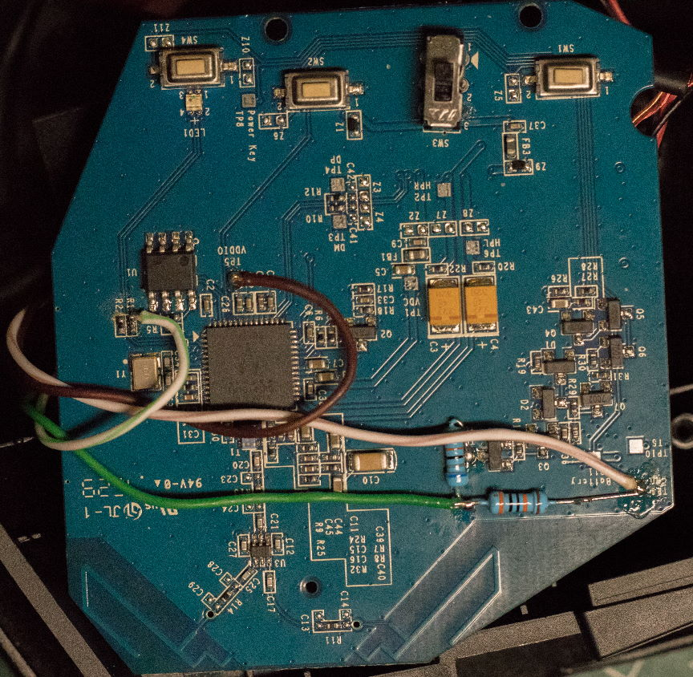

# Strix Wireless headset battery monitor

Strix Wireless headsets have no way of reporting if the battery is going to die (except the blue LED on the _side_) so I decided to build my own solution for battery monitoring.

# Headset modication

## Hardware

It's based on an nRF51822 which is an ARM based BLE enabled MCU. This advertises the battery voltage, mic status and charging status every ~3 seconds.

The battery voltage is measued using a 680k/300k voltage divider which scales the 3.0V - 4.2V LiPo range to the 0.0V - 1.3V ADC range.

The data is put into the manufacturer field of the advertisement data and follows this format:

|Offset|Length|Description|
|---|---|---|
|0x00|0x01|Length and version data: *0b XXXX YYYY*, where X is the length of _this_ structure, Y is the version (1).|
|0x01|0x01|Flags: *0b 0000 00XY*, where X is the charge LED status and Y is the MIC mute status.|
|0x02|0x02|Battery voltage ADC measurement.|
|0x04|0x02|Battery voltage (divide by 1000 to get the actual voltage).|

## Wiring

Most of the required connections are nicely labelled on the PCB.

|Pad on PCB|MCU Pin|Usage|
|---|---|---|
|GND|GND|Main ground.|
|VDDIO|VCC|Main 3.3V, present when the headphones is turned on.|
|VBAT|P0.01|Battery measurement pad, connect through the 680k/300k voltage divider. The ADC is 1.3V max! VBAT is disabled when the headphones is turned off, this saves some battery life.|
|Pin 3 of SW3|P0.02|Mic mute detect. Pin 2 of SW3 is GND, this can be used to detect the state of the switch.|
|R1 (or pin 2 of LED1)|P0.30|Charge detect.|

## Pictures

Unmodified PCB:

Connections:

Modification in place:

# Custom receiver stick

I decided to build a custom BLE receiver stick instead of using the BLE API from Windows, because it only works with UWP apps and most of the BLE sticks that I had did not work with this API.

## Hardware

The stick uses a CH340 based USB to serial converter and an nRF51822 based WT51822-S4AT BLE module. The serial converter module provides 3.3V to the BLE module which communicates using a simple 115200 baud serial port.

## Software

My goal was to create a simple taskbar icon which shows the battery and the microphone state of the headphones. This app connects to the receiver stick using the virtual serial port.

The stick accepts 2 commands:

|Command|Parameters|Description|
|----|----|----|
|0xAF|Client MAC|Starts listening to BLE advertisements from the specified MAC.|
|0xBF|-|Stops listening|

When a BLE advertisement packet arrives from the specified MAC the following packet is sent back from the stick:

|Offset|Length|Description|
|----|----|----|
|0x00|0x01|Data header - always 0xA5|
|0x01|0x01|Data length (n)|
|0x02|n|BLE advertisement data which contains the custom manufacturer specific data specified in the headset modification section.|

Based on this data the tray icon can show the following states:

|State|Tray icon|Description|
|---|---|---|
|Unknown||If no advertisement is received for more than 30seconds az unknown state is shown.|
|Battery depleted|||
|Normal|||
|Charging|||
|Muted||When the mic is muted a battery state icon and a mute icon is swapped every second.|